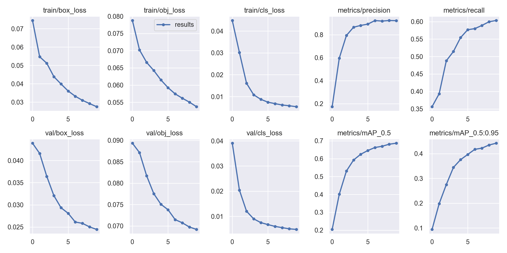

# Object_tracking_model_YOLO_V5
Model was made as an exercise in the science club : AGH_RACING
# Model's basic documentation:
 - Dataset consists of 23 GB photos of cones in Supervisely format. Training set consists 80% of all photos and testing set consists 20% of all photos.
 
 # Model properties:

## Configuration
 It's necessary to clone yolov5 model to the Object_tracking_model independently. I had some difficulties to push changed yolov5 folder as a repo submodule on the github.
 
# ⚫STEP 1
    >> git clone https://github.com/ultralytics/yolov5 

    >> cd yolov5

    >> pip install -qr requirements.txt

# ⚪STEP 2
  
  - Move file: 'cones.yaml' to .\yolov5\data
  
  - Prepare your dataset. Data is in the Supervisely format originally, but yolov5 requires YOLOv5 PyTorch TXT format. There are two ways of having it done.
    
    ### First method
    You can preprocess data using files in Repo in the following order:
    1. parse_annotations.py
    2. extract_images_to_single_folder.py
    3. test_parsed_annotations.py
    4. partition_data.py
    
    ### Second method
    
    - Make use of Roboflow app (https://app.roboflow.com) and apply their data converter (Supervisely JSON ->  YOLOv5 PyTorch TXT)
  
# ⚫STEP 3
  - Run 'train_command.txt' on your preprocessed dataset. In case you didn't have GPU I prepared you a ready result from the calculations in the 'model_results' folder.
 
 ## Dataset is available under the following link:
 - https://www.fsoco-dataset.com/download
 
 ## I added other model made in the Google Colab notebook (with free access to their GPU). The notebook is available at the following link :
 - https://colab.research.google.com/drive/1H1gqPZ8LKiqk0qIbZd6B5OKFJxWCMzTM?usp=sharing
 
   Ready for use dataset is smaller, but the number of epochs is greater. 
